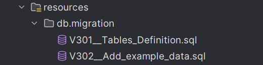
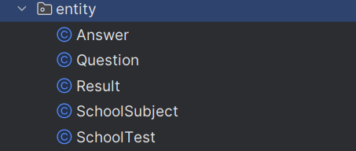
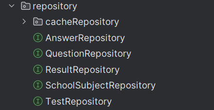
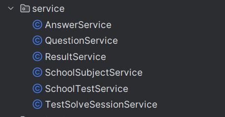
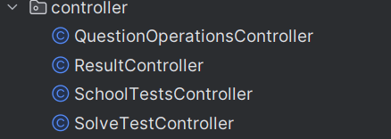
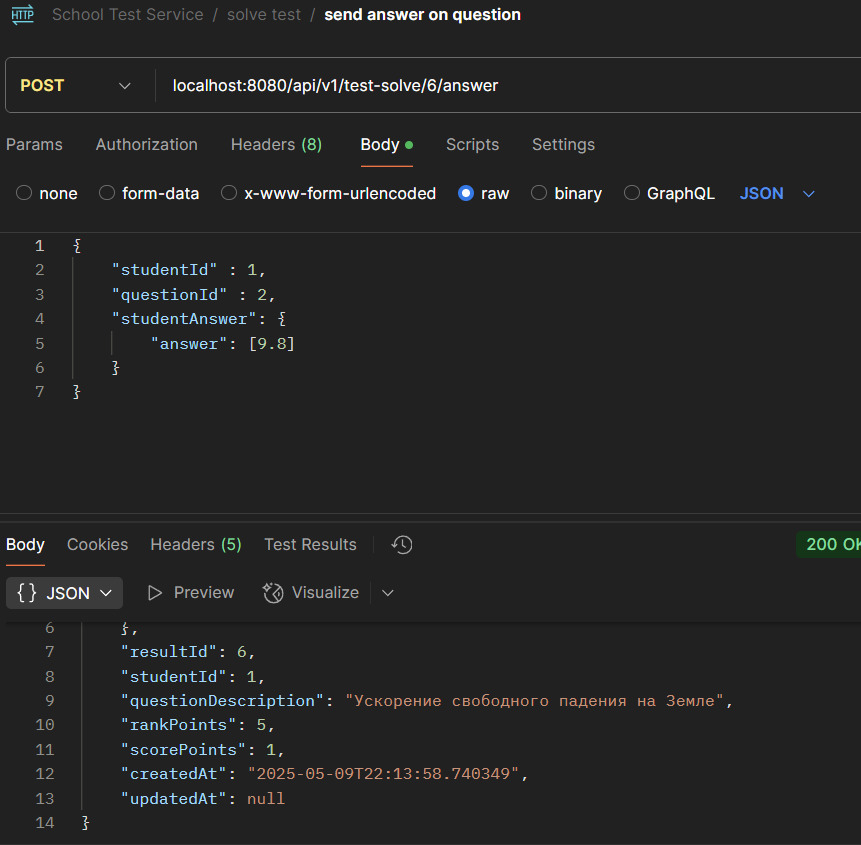
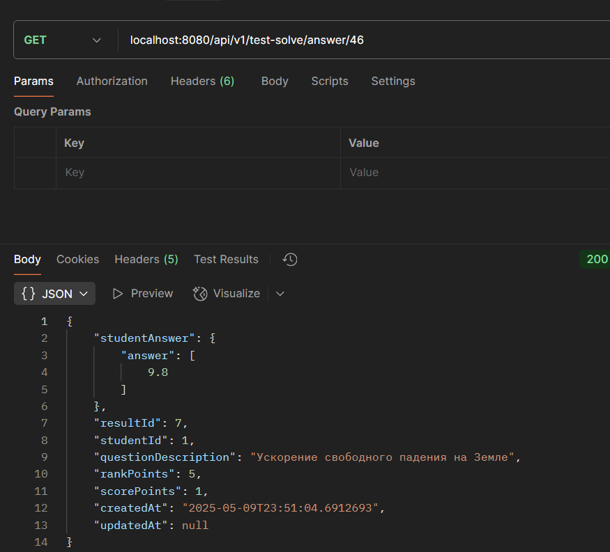

### Индивидуальная работа 
Тема проекта: Сервис создания и рещения тестов
Выполнил: Алексеев Сергей
Преподователь: Кристиан Ульману

### Цель работы
1) Реализация многофункционального приложения. Поддержка CRUD операций и тд
2) Использование двух видов баз данных


### Ход работы
#### PostgreSQl
1) Подключение Postgres, создание миграций с базовыми таблицами и опрделение сущностей
 - Подключение Postgres: для начала добавляяем зависимость на 
spring data в файл сборки проекта, в моем случае это Gradle. Далее опрдеяем 
свойства подключения к нашей базе данных
```yaml
     #Data config
     datasource:
       url: jdbc:postgresql://localhost:5434/postgres
       username: user
       password: user
     #JPA config - 
     jpa:
       hibernate:
         ddl-auto: none # отключаем авто генерацию jpa таблиц
       properties:
         hibernate:
           dialect: org.hibernate.dialect.PostgreSQLDialect # указываем нужный диалект
           show_sql: true
```
 - 

 - Миграции: для миграий была использована библиотке Flyway
    
 - Property flyway in application.yml
```yaml
     #Flyaway config
     flyway:
       enabled: true
       locations: classpath:db/migration
       baseline-on-migrate: true 
```

2) Опрделяем наши Entity внутри Spring

- Пример сущности
```java
  @Data
@AllArgsConstructor
@NoArgsConstructor
@EqualsAndHashCode(of = {"question", "studentId"})
@ToString(exclude = {"question", "result"})
@Builder
@Entity
@Table(name =  "answers", schema = "hc_school_tests_sc")
public class Answer {
    @Id
    @GeneratedValue(strategy = GenerationType.IDENTITY)
    private Long id;

    @Convert(converter = AnswerJsonConverter.class)
    @Column(name = "student_answer", columnDefinition = "jsonb")
    private Map<String, List<Object>> studentAnswer;

    @ManyToOne
    @JoinColumn(name = "result_id")
    private Result result;

    @Column(name = "student_id")
    private Long studentId;

    @ManyToOne
    @JoinColumn(name = "question_id")
    private Question question;


    @Column(name = "rank_points")
    private Integer rankPoints;

    @Column(name = "score_points")
    private Integer scorePoints;

    @Column(name = "created_at", nullable = false, updatable = false)
    private LocalDateTime createdAt;

    @Column(name = "updated_at")
    private LocalDateTime updatedAt;

    @PrePersist
    public void onPersist(){
        this.createdAt = LocalDateTime.now();
    }

    @PreUpdate
    public void  onUpdate(){
        this.updatedAt = LocalDateTime.now();
    }


}  
```

3) Определяем репозитории для работы с данными Entity

- Пример репозитория:
```java
    public interface AnswerRepository extends JpaRepository<Answer, Long> {
    List<Answer> findAllByStudentIdAndResultId(Long studentId, Long resultId);


    Optional<Answer> findByCreatedAtAndId(LocalDateTime createdAt, Long id);
}
```
4) Определяем сервисный слой, который будет выполнять основную бизнес-логику приложения

 - Каждый сервис содержит базовые Crud операции
```java
    @Service
@Slf4j
@RequiredArgsConstructor
public class AnswerService {
    private final AnswerMapper answerMapper;
    private final AnswerPointsHandler pointsHandler;
    private final AnswerRepository answerRepository;
    private final AnswerCacheRepository answerCacheRepository;

    public Answer getAnswerById(Long id) {
        log.info("Get answer by id: {}", id);
        return answerRepository.findById(id)
                .orElseThrow(() -> new AnswerNotFoundException("Answer by id" + id + "not found"));

    }

    public List<Answer> getAnswersByStudentIdAndResultId(Long studentId, Long resultId) {
        return answerRepository.findAllByStudentIdAndResultId(studentId, resultId);
    }

    @Transactional
    public Answer createAnswer(AnswerRequest request) {
        Answer answer = answerMapper.toAnswer(request);
        pointsHandler.defineAnswerCorrectness(answer);

        return answerRepository.save(answer);
    }
    @Transactional
    public Answer updateAnswer(Long answerId, AnswerRequest request) {
        Answer answer = getAnswerById(answerId);
        if (!Objects.equals(answer.getResult().getId(), request.getResultId())) {
            throw new ThisAnswerHasInvalidResultId("Invalid Result id:" + request.getResultId());
        }
        if (answer.getStudentAnswer().get("answer").equals(request.getStudentAnswer().get("answer"))) {
            return answer;
        }
        answer.setStudentAnswer(request.getStudentAnswer());
        pointsHandler.defineAnswerCorrectness(answer);
        return answerRepository.save(answer);
    }

    public void deleteAnswer(Long id) {
        answerRepository.deleteById(id);
        answerCacheRepository.deleteById(id);
    }
}
```


### Redis
Следующим этапом было подключение Redis, которое служило бы кэш хранилищем для  `Answer entity`.

1) Для начала указываем свойства redis'a в проперти файле
```yaml
     cache:
     redis:
       time-to-live: 1m
     data:
       redis:
         host: localhost
         port: 6379 
```
2) Далее создаем конфиг класс, в котором опрделяем бины `RedisCacheManager`, `RedisTemplate<String, AnswerResponse>`
```java
@Setter
@Configuration
@ConfigurationProperties(prefix = "spring.cache.redis")
@RequiredArgsConstructor
public class RedisConfiguration {

    private final Duration defaultTimeToLive = Duration.ofMinutes(1);
    private final ObjectMapper objectMapper;

    @Bean
    public RedisCacheManager cacheManager(RedisConnectionFactory connectionFactory){
        ObjectMapper objectMapper = new ObjectMapper();
        objectMapper.registerModule(new JavaTimeModule());
        objectMapper.disable(SerializationFeature.WRITE_DATES_AS_TIMESTAMPS);

        RedisCacheConfiguration configuration = RedisCacheConfiguration.defaultCacheConfig()
                .entryTtl(defaultTimeToLive)
                .serializeValuesWith(RedisSerializationContext.SerializationPair
                        .fromSerializer(new GenericJackson2JsonRedisSerializer(objectMapper))
                );

        return RedisCacheManager.builder(RedisCacheWriter.nonLockingRedisCacheWriter(connectionFactory))
                .cacheDefaults(configuration)
                .build();
    }

    @Bean
    public RedisTemplate<String, AnswerResponse> answerRedisTemplate(RedisConnectionFactory connectionFactory) {
        RedisTemplate<String, AnswerResponse> template = new RedisTemplate<>();
        template.setConnectionFactory(connectionFactory);


        Jackson2JsonRedisSerializer<AnswerResponse> serializer = new Jackson2JsonRedisSerializer<>(AnswerResponse.class);
        serializer.setObjectMapper(objectMapper);
        template.setValueSerializer(serializer);

        return template;
    }
}
```
3) Следом определяем кэш-репозиторий, который будет предоставлять методы дял управления нашим кэшом
```java
@Slf4j
@Repository
@RequiredArgsConstructor
public class AnswerCacheRepository {
    private final RedisTemplate<String, AnswerResponse> redisTemplate;
    private final AnswerCacheTtlHandler ttlHandler;
    private final AnswerMapper mapper;
    
    public void save(Answer answer) {
        Duration answerTtl = ttlHandler.calculateTtl(answer);
        if (answerTtl.isZero()){
            log.info("Time expired answer doesnt may to save in  cache");
            return;
        }
        AnswerResponse responseAnswer = mapper.answerToResponse(answer);
        redisTemplate.opsForValue().set("answer:" + answer.getId(), responseAnswer, answerTtl);
    }

    public AnswerResponse findById(Long id) {
        AnswerResponse cachedAnswerResponse = redisTemplate.opsForValue().get("answer:" + id);
        log.info("Get cached Answer by id: {}", id);
       return cachedAnswerResponse;
    }

    public void deleteById(Long id) {
        redisTemplate.delete("answer:" + id);
    }
}
```
- Дополнительно был создан компонент для опредления TTL кэша или же его время жизни,
которое в нашем случае основывается на времени начала решения теста, на его длительности и времени ответа на вопрос
```java
@Component
@Getter
@Setter
@RequiredArgsConstructor
@Slf4j
public class AnswerCacheTtlHandler implements CacheTtlCalculator<Answer> {
    private final ResultService resultService;


    @Override
    public Duration calculateTtl(Answer answer) {
        LocalDateTime answerPostTime = answer.getUpdatedAt() == null
                ? answer.getCreatedAt()
                : answer.getUpdatedAt();

        LocalDateTime resultStartTime = answer.getResult().getStartedAt();

        Duration testDuration = Duration.ofMinutes(answer.getResult()
                .getSchoolTest()
                .getDuration());

        LocalDateTime endTime = resultStartTime.plus(testDuration);

        Duration ttl = Duration.between(answerPostTime, endTime);

        if (!ttl.isNegative() && !ttl.isZero()) {
            log.info("TTl is set for answer by id:{} and ttl:{}",answer.getId(), ttl);
            return ttl;
        } else {
            log.info("TTl is not set for answer by id:{}, cause ttl is 0", answer.getId());
            return Duration.ofMinutes(0);
        }
    }
}
```
### Валидация данных
1) Были созданы request классы, которые хранят в себе валидацию полей.
```java
@Data
@Builder
@NoArgsConstructor
@AllArgsConstructor
@ToString
public class SchoolTestRequest {
    @NotNull(message = "Fill this field")
    private String title;

    @NotNull(message = "Set the teacher id")
    private Long teacherId;

    @NotNull(message = "Set test type")
    private TestType testType;

    @NotNull(message = "Select a school subject of this test")
    private String schoolSubjectName;

    @NotNull(message = "Set complexity")
    private Complexity testComplexity;

    @NotNull(message = "Set a class level of the test")
    private Integer classLevel;

    @Size(max = 255, message = "Too long description")
    private String description;

    @Max(value = 90, message = "Test duration has been max 90 minutes length")
    private Integer duration;
}
```
2) Так же был определен `AdviceController`, который вылавливыает ошибки 
валидации и выдает пользователю корректый отчет об ошибке.
```java
@ControllerAdvice
public class ErrorHandlingControllerAdvice {


    /**
     * Метод для обработки ошибок валидации внутри тела запроса
     *
     * @param e - ConstraintViolationException - метод ловит это исключение и обрабаывает его получая из его тела все ошибки
     * @return ErrorResponse - который хранит в себе поле в котором была ошибка и сам текст ошибки
     */
    @ResponseBody
    @ExceptionHandler(ConstraintViolationException.class)
    @ResponseStatus(HttpStatus.BAD_REQUEST)
    public ValidationErrorResponse onConstraintValidationException(ConstraintViolationException e) {
        final List<Violation> violations = e.getConstraintViolations().stream()
                .map(
                        violation -> new Violation(
                                violation.getPropertyPath().toString(),
                                violation.getMessage()
                        )
                )
                .collect(Collectors.toList());
        return new ValidationErrorResponse(violations);
    }


    /**
     * Метод ообрабатывает ошибки валидации в параметрах метода
     *
     * @param e MethodArgumentNotValidException - исключение из тела которого мы получаем ошибки валдации.
     * @return
     */
    @ExceptionHandler(MethodArgumentNotValidException.class)
    @ResponseStatus(HttpStatus.BAD_REQUEST)
    @ResponseBody
    public ValidationErrorResponse onMethodArgumentNotValidException(
            MethodArgumentNotValidException e
    ) {
        final List<Violation> violations = e.getBindingResult().getFieldErrors().stream()
                .map(error -> new Violation(error.getField(), error.getDefaultMessage()))
                .collect(Collectors.toList());
        return new ValidationErrorResponse(violations);
    }

}
```

### Обработка запросов
1) Для обработки запросов были определены REST-контроллеры.

- Пример контроллера
```java
@RestController
@RequiredArgsConstructor
@RequestMapping("/api/v1/test")
public class QuestionOperationsController {
    private final QuestionService questionService;
    private final QuestionMapper questionMapper;


    @GetMapping("/{testId}/questions")
    public ResponseEntity<List<QuestionResponse>> getTestQuestions(@PathVariable Long testId) {

        List<QuestionResponse> questionResponses = questionService.getAllTestQuestions(testId).stream()
                .map(questionMapper::toResponse)
                .toList();
        return ResponseEntity.ok(questionResponses);
    }

    @GetMapping("/{testId}/questions/{questionId}")
    public ResponseEntity<QuestionResponse> getQuestionInTestById(@PathVariable Long testId,
                                                                  @PathVariable Long questionId) {
        Question question = questionService.getQuestionByIdAndTestId(questionId, testId);
        QuestionResponse response = questionMapper.toResponse(question);
        return ResponseEntity.ok(response);
    }

    @PostMapping("/{testId}/questions")
    public ResponseEntity<QuestionResponse> addQuestionToTest(@PathVariable Long testId,
                                                              @RequestBody QuestionRequest questionRequest) {
        Question question = questionService.addQuestionToTest(testId, questionRequest);
        QuestionResponse response = questionMapper.toResponse(question);

        return ResponseEntity
                .status(HttpStatus.CREATED)
                .body(response);
    }

    @PutMapping("/{testId}/questions/{questionId}")
    public ResponseEntity<QuestionResponse> updateQuestionInTest(@PathVariable Long testId,
                                                                 @PathVariable Long questionId,
                                                                 @RequestBody QuestionRequest questionRequest) {
        Question question = questionService.updateQuestionInTest(questionId, testId, questionRequest);
        QuestionResponse response = questionMapper.toResponse(question);

        return ResponseEntity.ok(response);
    }

    @DeleteMapping("/{testId}/questions/{questionId}")
    public ResponseEntity<DeleteResponse> deleteQuestion(@PathVariable Long testId,
                                                         @PathVariable Long questionId) {
        questionService.deleteQuestion(questionId, testId);
        DeleteResponse deleteResponse = new DeleteResponse("Successful Delete!");
        return ResponseEntity.ok(deleteResponse);
    }
    
}
```

4) Пример запроса для проверки кэшированияю. Сущность сохраняет и в postgres and in redis

- Получение ответа на вопрос


### 📌 Заключение
Я успешно реализовал гибкую и расширяемую архитектуру, в которой:

SQL используется для хранения постоянных данных

Redis — для временного кэширования и повышения производительности

Валидируются входные данные для обеспечения корректности API